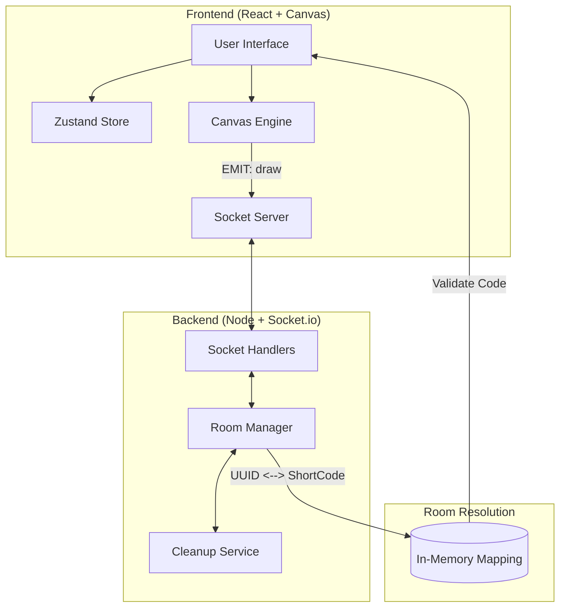

# എഴുത്ത് — Ezhuth

> Draw together, in real time.

Ezhuth is a real-time collaborative whiteboard where multiple people can draw simultaneously in a shared room. No accounts. No setup. Just share the link.


---

---

## 🛠️ Features

- **Real-time drawing sync** — strokes appear on all connected clients within milliseconds
- **6-Digit Room Codes** — Every board has a unique, easy-to-read **6-digit code** (e.g., `AEFGKO`) for quick entry.
- **Late-joiner state replay** — join a room mid-session and see the full canvas history instantly
- **Live cursors** — see where other users are drawing in real time
- **Presence indicators** — colored dots show who's in the room
- **Toolbar** — color swatches, brush size, eraser, and clear canvas
- **Optimistic rendering** — your strokes draw instantly, before the server even responds

---

## 🧱 Tech Stack

| Layer | Technology |
|---|---|
| Frontend | React (Vite), HTML5 Canvas API, Zustand |
| Styling | Tailwindcss |
| Realtime | Socket.IO (WebSocket) |
| Backend | Node.js, Express |
| Room IDs | UUID v4 + **6-Digit Short Code Mapping** |

---

## 🏗️ Architecture

Ezhuth is built as a **real-time event relay system**. The server maintains a canonical state of all active rooms and maps user-friendly short codes to internal session IDs.

### System Overview



### Key architectural decisions

**Short Code Mapping** — Rooms are identified by a canonical UUID v4, but users interact with a 6-digit alphanumeric code. The server's `RoomManager` resolves all incoming codes to their canonical IDs before joining users to a shared broadcast channel.

**Two-canvas pattern** — a `canvas-committed` layer holds all completed strokes, and a `canvas-active` layer holds only the stroke currently being drawn. This avoids redrawing the entire history on every mouse move.

**Optimistic rendering** — strokes are drawn locally before being emitted to the server. The server echo is ignored on the originating client. Drawing feels instant regardless of network latency.

**Late-joiner sync** — the server maintains an ordered in-memory stroke log per room. When a new client joins, the full history is replayed on their canvas. A pending queue handles strokes that arrive during replay.

---

## Project Structure

```
/
├── client/                   # React frontend
│   └── src/
│       ├── canvas/
│       │   ├── engine.js     # Draw primitives, two-canvas pattern
│       │   └── replay.js     # Stroke history replay + pending queue
│       ├── socket/
│       │   ├── client.js     # Socket singleton
│       │   └── events.js     # All socket event handlers
│       ├── components/
│       │   ├── Whiteboard.jsx
│       │   ├── Toolbar.jsx
│       │   └── CursorLayer.jsx
│       ├── store/
│       │   └── useDrawStore.js  # Zustand store
│       └── App.jsx
│
└── server/                   # Node.js backend
    └── src/
        ├── rooms/
        │   ├── manager.js    # In-memory room state + stroke log
        │   └── cleanup.js    # Empty room garbage collection
        └── sockets/
            └── handlers.js   # All socket event handlers
    └── server.js             # Entry point
```

---

## Getting Started

### Prerequisites

- Node.js 18+
- npm

### Installation

```bash
# Clone the repo
git clone https://github.com/blitzbugg/ezhuth.git
cd ezhuth

# Install all dependencies (root + client + server)
npm install
npm install --prefix client
npm install --prefix server
```

### Development

```bash
# Run both client and server concurrently
npm run dev
```

- Frontend: `http://localhost:5173`
- Backend: `http://localhost:3001`

The Vite dev server proxies `/socket.io/*` to the backend automatically — no CORS issues.

### Production build

```bash
npm run build --prefix client
```

---

## How It Works

### Joining a room

1. Visit the landing page and click **Start Drawing**.
2. A unique **6-digit code** (e.g., `AEFGKO`) is generated for your board.
3. Share the code or the short URL with anyone.
4. Others can join by entering the code on the homepage, or via the direct link.

### Drawing flow

1. Interaction captured on `canvas-active`.
2. Stroke drawn locally on `canvas-active` immediately (optimistic).
3. Stroke event emitted to server (throttled).
4. Server resolves the room (via UUID or short code), appends to log, and relays to peers.
5. Other clients render the stroke on their `canvas-committed` layer.

### Late-joiner sync

1. New client emits `join-room`
2. Server sends full `stroke-history` array to that client only
3. Client replays all strokes on `canvas-committed`
4. Any live `draw` events that arrive during replay are queued and flushed after replay completes

---

## Stroke Event Schema

Every draw event carries exactly these fields:

```json
{
  "strokeId": "uuid-v4",
  "type": "draw",
  "x": 120,
  "y": 200,
  "prevX": 115,
  "prevY": 195,
  "color": "#6d4aff",
  "size": 4,
  "userId": "uuid-v4"
}
```

---

## Socket Events

| Event | Direction | Description |
|---|---|---|
| `join-room` | Client → Server | Join a room, receive stroke history |
| `stroke-history` | Server → Client | Full stroke log for late joiners |
| `draw` | Client ↔ Server | A stroke delta |
| `cursor` | Client ↔ Server | Cursor position (throttled 50ms) |
| `clear` | Client ↔ Server | Wipe the canvas for all clients |
| `your-color` | Server → Client | Assigned user color on join |
| `user-joined` | Server → Room | A new user joined |
| `user-left` | Server → Room | A user disconnected |

---

## Roadmap

- [x] Phase 1 — Real-time stroke sync, late-joiner replay, room URLs
- [x] Phase 2 — Toolbar, live cursors, presence dots, landing page, UI polish
- [ ] Phase 3 — Per-user undo (Ctrl+Z), PNG export, stroke deduplication
- [ ] Phase 4 — Redis Pub/Sub adapter, multi-server scaling, persistence

---

## Design

The UI is built around a clean, minimal light theme — warm off-white canvas, a floating glassmorphism toolbar, violet accents. The app name uses *Instrument Serif* on the landing page; the rest of the UI uses *Inter*.

The design philosophy: get out of the way. The canvas is the product.

---
